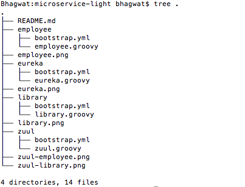
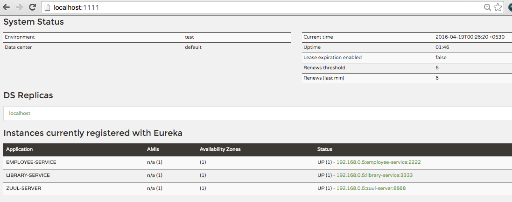
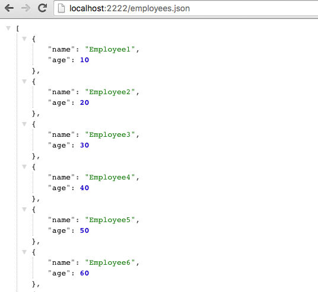
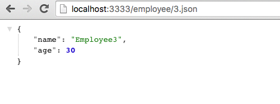
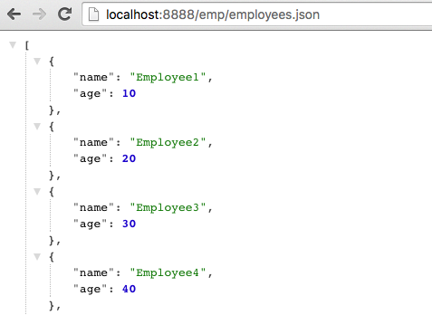
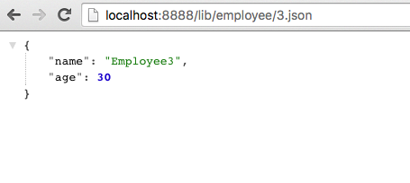

# Micro-service with SpringBoot CLI and Spring Cloud

Each sample micro-service contains just two files: bootstrap.yml and a groovy file defining the main spring boot application



## Discovery Server

SpringBoot CLI Infra service for Service Discovery
 
```bash
 $ cd eureka
 $ spring run eureka.groovy #Runs on port 1111.
```

Eureka dashboard is available at http://localhost:1111


  
## Employee Service
 
SpringBoot CLI business service which defines two endpoints "/" and "/employees".
  
```bash
  $ cd employee
  $ spring run employee.groovy                       #Instance 1 on port 2222
  $ spring run employee.groovy -- --server.port=2223 #Instance 2 on port 2223
  
  $ curl -XGET http://localhost:2222/employees.json

```



## Library Service
 
SpringBoot CLI business service which defines two endpoints "/" and "/employee/{employeeId}".

"/employee/{employeeId}" endpoint uses load balanced restTemplate bean to make call to employee service endpoints.
  
```bash
  $ cd library
  $ spring run library.groovy                        #Instance 1 on port 3333
  $ spring run library.groovy -- --server.port=3334  #Instance 2 on port 3334

  $ curl -XGET http://localhost:8888/employee/2.json 

```



## Gateway Server

SpringBoot CLI Infra service for API gateway. It defines "/emp" and "/lib" gateway endpoints which in turn forwards the request to related microservice.
Zuul service is discoverable by Discovery service and if multiple instances of a service is running it will take care of client side load balancing.

```bash
  $ cd zull
  $ spring run zull.groovy    #Runs on port 8888
  
  $ curl -XGET http://localhost:8888/emp/employees.json # Accesses Employee service
  
  $ curl -XGET http://localhost:8888/lib/employee/2.json # Accesses Library service which in turn uses employee service
```




